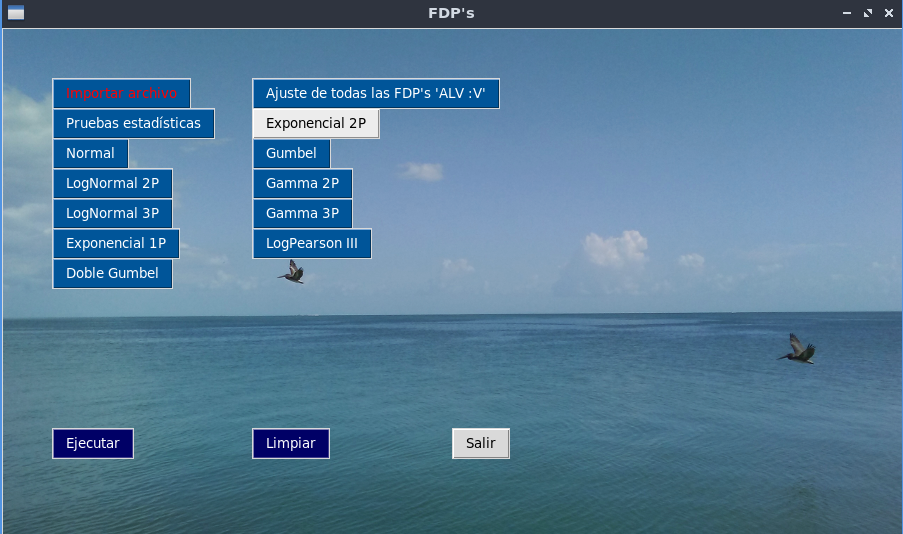
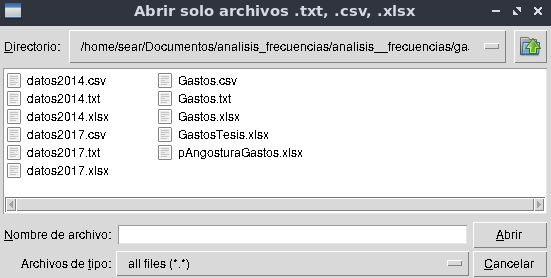
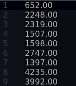
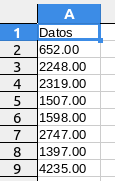
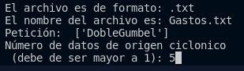

# ⛈   Analisis_de_Frecuencias   ⛈

## Resumen

Aplicación que despliega una interfaz que permite realizar análisis estadisticos a los procesos hidrológicos 
considerando por lo pronto diez funciones de distribución de probabilidad.

* Normal
    * Momentos y Máxima verosimilitud

* Lognormal de 2 parámetros
    * Momentos y Máxima verosimilitud

* Lognormal de 3 parámetros
    * Momentos y Máxima verosimilitud

* Exponencial de 1 parámetro
    * Momentos y Máxima verosimilitud

* Exponencial de 2 parámetros
    * Momentos y Máxima verosimilitud

* Gamma de 2 parámetros
    * Momentos y Máxima verosimilitud

* Gamma de 3 parámetros
    * Momentos y Máxima verosimilitud

* Log Pearson Tipo III
    * Momentos

* Gumbel
    * Momentos y Momentos L

* Doble Gumbel
    * Solución sin optimizar y optimizada por el algoritmo de Rosenbrock

También se consideran las pruebas estadísticas de homogeneidad (Helmert, T de student y Cramer),  e independencia de eventos de una muestra. 

## Comenzando 🚀

_Estas instrucciones te permitirán obtener una copia del proyecto en funcionamiento en tu máquina local para propósitos de desarrollo y pruebas._

### Pre-requisitos 📋

_Necesitas tener un SO windows o Linux y tener instalado python en tu computadora_

### Instalación 🔧

_Antes de comenzar, se recomienda generar un entorno de trabajo e iniciarlo con python 3.11.7._

Ejemplo con Anaconda:

```
conda create -n nombre_entorno python=3.11.7
conda install --yes --file requirements.txt
```
De igual manera se puede generar un entorno de python nativo en tu computadora y usando requirements.txt,

```
pip install -r requirements.txt
```
## Despliegue 📦

Paso 1: Activar el entorno de conda o entorno python que se creó con las especificaciones que se menciona en el apartado "Requisitos".

Paso 2: Correr el script en una terminal, escribir el comando:

```
python principal.py
```
Paso 3:Se despliega una ventana, primero hay que importar el archivo en donde tenemos los datos que se usarán para los ajustes. Se pulsa el botón "Importar archivo", entonces se desplegará un explorador de archivos. Se pueden importar archivos .txt, .csv o .xlsx.





Ejemplo de como almacenar los datos en los archivos .txt, csv o xlsx

 

Paso 4: Se seleccionan las funciones de distribución requeridas o pruebas estadísticas en los botones mostrados. De igual manera hay una forma de seleccionar todas las opciones, selecionando el botón "Ajuste de todas las FDP's". Finalmente se selecciona el botón ejecutar.

Paso 5: Una vez seleccionados los ajustes requeridos se mostraran gráficos de estos y finalmente se guardaran las imagenes png y un reporte del ajuste en formato xlsx en la carpeta de salidas.

##### Nota: en caso de requerir más de un ajuste el xlsx tendra una hoja independiente para los ajustes.

Paso 6: En caso de seleccionar el ajuste de doble Gumbel, se mostrará un gráfico en donde usted decidirá el número de eventos de origen ciclonico.


Se cierra el gráfico y en la terminal se debe dar el número de datos de origen ciclonico.



Paso 7: Al terminar se despliega un mensaje de termino, se puede generar otro ajuste pulsando el botón "Limpiar" y comenzar de nuevo desde el paso 4.


